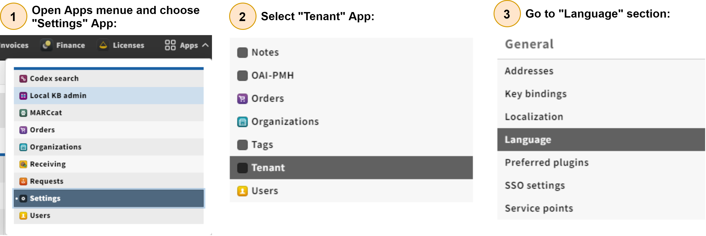

# User Locales Switcher

This document explains the implementation  lays out requirements for settings and preferences, as discussed in [UIP-1](https://issues.folio.org/browse/UIP-1), and proposes how Stripes should support them. These concepts are similar but distinct, and properly supporting both will require changes to the Stripes core.

## Table of contents

* [Introduction](#introduction)
* [Implementation](#implementation)
* [Adding new back-end module](#adding-new-back-end-module)
* [Changes to existing modules](#changes-to-existing-modules)
* [Language section in tenant-settings module](#language-section-in-tenant-settings-module)
    * [Tenant available locales](#tenant-available-locales)
    * [Tenant default locale](#tenant-default-locale)
* [User language info section in user profile (Users App)](#user-language-info-section-in-user-profile-users-app)
* [User Language Switcher in main navbar (Stripes-core)](#user-language-switcher-in-main-navbar-stripes-core)

## Introduction

## Implementation
  User locales switcher has four axes:
  1-[Adding new back-end module](#adding-new-back-end-module) called [mod-user-locales](https://github.com/attia-alshareef/mod-user-locales) for handling the server side work needed
  2- The system administrator chooses the locales available to the tenant and choose the default locale for the tenant of them.
  3- The end user chooses the list of locales he wants to navigate from among the locales available to the tenant and chooses his preferred locale.
  4- Handling the login process in order to log in the user's preferred language if it exists, otherwise the login is in the default language for the tenant.

## Adding new back-end module

## Changes to existing modules

## Tenant available locales

## User language info section in User Profile (Users App)

## User Language Switcher in main navbar (Stripes-core)

