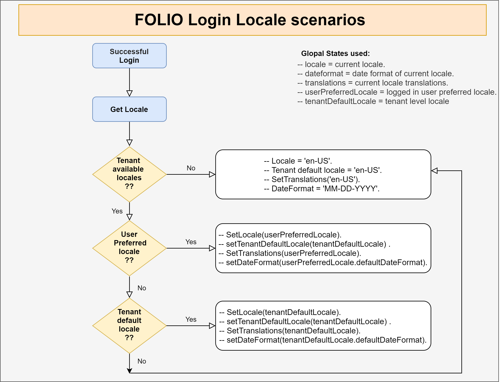

# User Locales Switcher

This document explains the implementation and structure of the "User Locales Switcher" module including background service.

## Table of contents

* [Introduction](#introduction)
* [Implementation Plan](#implementation-plan)
* [Adding new back-end module](#adding-new-back-end-module)
* [Adding new elements to the Stripes object](#adding-new-elements-to-the-stripes-object)
* [Changes to existing modules](#changes-to-existing-modules)
* [Language section in tenant-settings module](#language-section-in-tenant-settings-module)
    * [Tenant available locales](#tenant-available-locales)
    * [Tenant default locale](#tenant-default-locale)
    * [Default date format for locales](#Default-date-format-for-locales)
* [User language info section in user profile (Users App)](#user-language-info-section-in-user-profile-users-app)
    * [User's locales](#user's-locales)
    * [User's preferred locale](#user's-preferred-locale)
    * [User's numbers shape](#user's-numbers-shape)
* [Language Switcher in `Stripes-core`](#language-switcher-in-Stripes-core)
    * [Folio login locale scenarios‬](#folio-login-locale-scenarios‬)
    * [Folio language switcher scenarios‬](#folio-language-switcher-scenarios)
    * [Adding new navbar‬](#adding-new-navbar)
* [Permissions required](#permissions-required)
    * [Back-end permissions](#back-end-permissions)
    * [UI Permissions](#ui-permissions)
* [Problems and challenges](#problems-and-challenges)
    * [Data loss when switching the language while the form is in progress](#data-loss-when-switching-the-locale-while-the-form-is-in-progress)
* [Recommendations and future work](#recommendations-and-future-work)

## Introduction

## Implementation Plan
  * User locales switcher has five axes: 
  1-[Adding new back-end module](#adding-new-back-end-module) called [mod-user-locales](https://github.com/attia-alshareef/mod-user-locales) for handling the server side work needed. 
  2- The system administrator chooses the locales available to the tenant and choose the default locale for the tenant of them. 
  3- The end user chooses the list of locales he wants to navigate from among the locales available to the tenant and chooses his preferred locale. 
  4- Handling the login process in order to log in the user's preferred language if it exists, otherwise the user is login with the default language for the tenant. 
  5- Adding language switcher dropdown menue in the `Main Navbar`.

## Changes to existing modules

## Adding new back-end module
[mod-user-locales](https://github.com/attia-alshareef/mod-user-locales) is a FOLIO back-end module to manage and handling the server side work needed by "User Locales Switcher" operations which controls the tenant and user locales.

**ModuleDescriptor: https://github.com/attia-alshareef/mod-user-locales/blob/master/descriptors/ModuleDescriptor-template.json 

[mod-user-locales](https://github.com/attia-alshareef/mod-user-locales) contains the following resources: 
   * `Locale` -- make a CRUD operations for the tenant available locales including the default date format for locales.
   * `User-Locale` -- make a CRUD operations for the user locales including user's preferred locale and user's numbers shape for the `Arabic` interface.
   

## Adding new elements to the Stripes object
   * We add the following elements to the Stripes object: 
     * `tenantLocales` -- an array of objects specifying the locales available to the tenant.
     * `setTenantLocales` -- a function by which client code can change the locales available to the tenant.
     * `tenantDefaultLocale` -- a short string specifying the prevailing default locale for the tenant, e.g. `en-US`.
     * `setTenantDefaultLocale` -- a function by which client code can change the prevailing tenantDefaultLocale: `stripes.setTenantDefaultLocale('en-US')`.
     * `dateformat` -- a short string specifying the prevailing date format for the current locale, e.g. `MM-DD-YYYY` When you are in the `English - United States` interface.
     * `setDateformat` -- a function by which client code can change the prevailing dateformat: `stripes.dateformat('YYYY/MM/DD')` When you are in the `Arabic` interface.
     * `userLocales` -- an array of objects specifying the locales list of the current logged in user.
     * `setUserLocales` -- a function by which client code can change the prevailing userLocales: `stripes.setUserLocales([{...}, {...}, {...}])`.
     * `userPreferredLocale` -- a short string specifying the prevailing user's preferred locale of the current logged in user, e.g. `en-US` or `ar-AR`.
     * `setUserPreferredLocale` -- a function by which client code can change the current logged in user's preferred locale: `stripes.setUserPreferredLocale('en-US')`
     * `userNumbersShape` -- a short string specifying the prevailing NumbersShape of the current logged in user, e.g. `Arabic` or `Hindu` When you are in the `Arabic` interface only.
     * `setUserNumbersShape` -- a function by which client code can change the current logged in user's numbers shape: `stripes.setUserNumbersShape('en')` for the `Arabic` numbers shape and `stripes.setUserNumbersShape('ar')` for the `Hindu` numbers shape.

## Language section in tenant-settings module
   ## Tenant available locales
   
   ## Tenant default locale
   
   ## Default date format for locales
   
## User language info section in User Profile (Users App)
   ## User's locales:
   
   ## User's preferred locale:
   
   ## User's numbers shape
   
## Language Switcher in `Stripes-core`
   ## Folio login locale scenarios
   

   ## Folio language switcher scenarios
   

   ## Adding new navbar‬

## Permissions required
   ## Back-end permissions:
   You can find a back-end permissions required for mod-user-locales in the `ModuleDescriptor` 
   [from here](https://github.com/attia-alshareef/mod-user-locales/blob/master/descriptors/ModuleDescriptor-template.json).
   ## UI Permissions:
   
## Problems and challenges   
   ## Data loss when switching the language while the form is in progress

## Recommendations and future work
